# 校园墙+ Campus Wall Plus

`campus-wall-plus` 是一个面向学校、校区和校园社群的多租户校园墙 SaaS 系统。一个平台可以同时服务多所学校，每所学校作为独立租户，拥有自己的用户、内容、分类、公告、审核规则和后台管理员。

项目包含三端：

- 后端服务：Spring Boot 3 + MyBatis-Plus + Sa-Token
- 后台管理：基于 `soybean-admin-element-plus` 的 Vue3 管理端
- 小程序端：uni-app + Vue3 校园生活社区界面

## 项目亮点

- 多租户隔离：核心业务表均带 `tenant_id`，普通用户和学校管理员只能访问本校数据。
- 权限分层：支持平台管理员、学校管理员、审核员、学生、游客等角色。
- 内容闭环：发帖、评论、点赞、收藏、举报、审核、通知流程完整。
- 校园业务模块：校园墙、失物招领、二手闲置、校园互助、活动社团、公告通知。
- 后台管理完整：租户、用户、内容、审核、举报、分类、公告、敏感词、操作日志等页面。
- 小程序 UI：绿色校园风、卡片化、年轻干净，适合校园生活社区场景。
- 可二次开发：代码按业务模块拆分，接口和页面均预留扩展空间。

## 演示截图

当前仓库已在 `imgs` 目录放置演示占位图。后续如果需要替换成真实运行截图，直接覆盖同名图片即可。

### 后台管理端

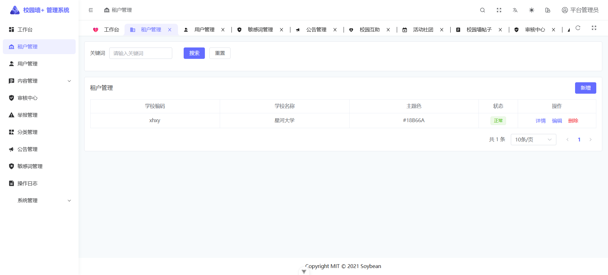

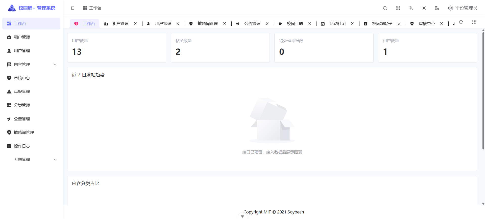


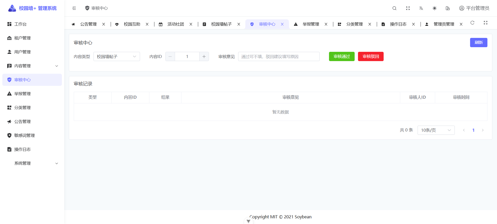

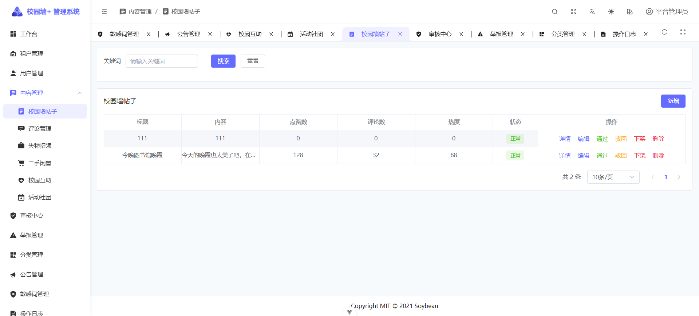

### 小程序端

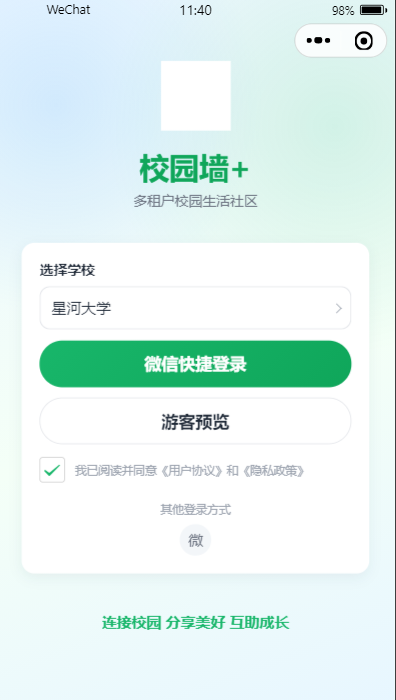

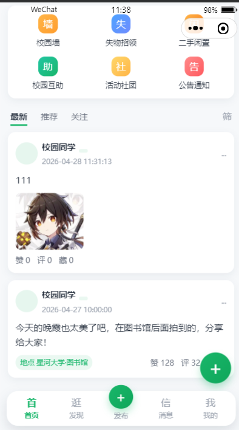

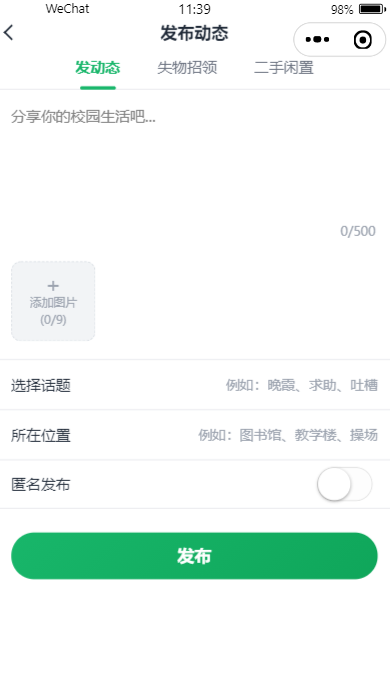

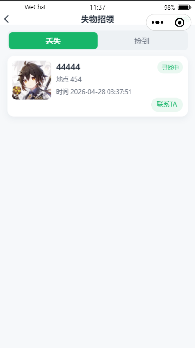

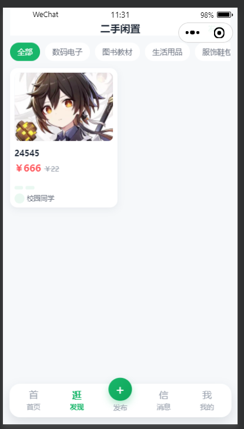

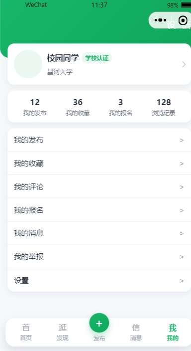

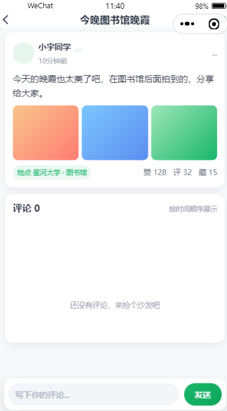

## 技术栈

### 后端

- Java 21
- Spring Boot 3.x
- MyBatis-Plus
- MySQL 8
- Redis
- Sa-Token
- Knife4j / Swagger
- Maven
- Lombok
- Hutool

### 后台管理端

- Vue3
- Vite
- TypeScript
- Pinia
- Element Plus
- UnoCSS
- soybean-admin-element-plus
- pnpm

### 小程序端

- uni-app
- Vue3
- Pinia
- SCSS
- 微信小程序

## 目录结构

```text
campus-wall-plus
├── campus-wall-plus-server      # Spring Boot 后端服务
├── campus-wall-plus-admin       # 后台管理端
├── campus-wall-plus-miniapp     # uni-app 小程序端
├── sql                          # MySQL 建表和初始化数据
├── imgs                         # 演示截图目录
└── README.md                    # 项目说明文档
```

## 核心功能

### 平台能力

- 租户开通、编辑、启用、停用
- 多学校数据隔离
- 平台管理员跨租户管理
- 学校管理员仅管理本校数据
- 审核员处理本校内容审核和举报
- 操作日志记录

### 小程序端

- 登录 / 租户选择
- 游客预览
- 首页信息流
- 校园墙帖子发布、编辑、删除
- 图片上传
- 评论、点赞、收藏
- 失物招领发布、详情、标记找回
- 二手闲置发布、详情、标记售出
- 校园互助发布、详情、标记完成
- 活动社团浏览与报名预留
- 我的发布、我的收藏、我的评论、我的举报、我的消息

### 后台管理端

- 工作台统计
- 租户管理
- 用户管理
- 内容管理
  - 校园墙帖子
  - 评论管理
  - 失物招领
  - 二手闲置
  - 校园互助
  - 活动社团
- 审核中心
- 举报管理
- 分类管理
- 公告管理
- 敏感词管理
- 系统管理
  - 管理员管理
  - 角色管理
  - 菜单管理
  - 操作日志

## 本地环境要求

- JDK 21
- Maven 3.8+
- MySQL 8
- Redis
- Node.js >= 20.19.0
- pnpm >= 8.7.0
- HBuilderX 或微信开发者工具

## 数据库与 Redis

本地开发默认配置：

```text
MySQL:
host: localhost
port: 3306
database: campus_wall_plus
username: root
password: 123456

Redis:
host: localhost
port: 6379
password: newhope123456
database: 0
```

生产环境不要使用本地密码，请通过环境变量或外部配置覆盖。

## 初始化数据库

项目 SQL 在 `sql/campus_wall_plus.sql`。

可以使用 MySQL 客户端执行：

```bash
mysql -uroot -p123456 < sql/campus_wall_plus.sql
```

或者进入 MySQL 后执行：

```sql
source E:/me/xiaoYuanQiang/sql/campus_wall_plus.sql;
```

初始化数据包含：

- 平台管理员：`admin / 123456`
- 示例租户：`星河大学`，租户编码 `xhxy`
- 学校管理员：`tenant_admin / 123456`
- 默认角色、菜单、分类和示例数据

## 启动后端

```bash
cd campus-wall-plus-server
mvn spring-boot:run
```

默认地址：

```text
http://localhost:8080
```

接口文档：

```text
http://localhost:8080/doc.html
```

## 启动后台管理端

后台管理端必须使用 pnpm。

```bash
cd campus-wall-plus-admin
pnpm install
pnpm dev
```

后台只保留两个环境：

- `.env.localhost`：本地开发，默认代理到 `http://localhost:8080`
- `.env.server`：服务器部署，默认同源 `/api`

构建服务器版本：

```bash
pnpm build
```

默认后台账号：

```text
平台管理员：admin / 123456
学校管理员：tenant_admin / 123456
```

## 启动小程序端

```bash
cd campus-wall-plus-miniapp
pnpm install
pnpm dev:mp-weixin
```

也可以构建微信小程序：

```bash
pnpm build:mp-weixin
```

微信小程序 AppID 请在本地 `campus-wall-plus-miniapp/src/manifest.json` 中填写，真实 AppID 不建议提交到公开仓库。

```text
请在本地填写微信小程序AppID
```

编译后使用微信开发者工具打开：

```text
campus-wall-plus-miniapp/dist/dev/mp-weixin
```

如果使用 HBuilderX 运行，请确保依赖已经安装完整，缺少编译器模块时先在小程序目录执行：

```bash
pnpm install
```

## 常用接口前缀

```text
/api/app/**       小程序端接口
/api/admin/**     后台管理端接口
/api/platform/**  平台管理接口
/api/common/**    公共接口
```

## 安全设计

- Sa-Token 登录认证
- 后台接口角色校验
- 平台管理员与租户管理员接口隔离
- MyBatis-Plus 多租户拦截
- 普通用户不能通过传入 `tenant_id` 越权访问其他学校数据
- 新增业务数据自动写入当前用户 `tenant_id`
- 逻辑删除
- 敏感词检测
- 发帖与评论频率限制
- 文件上传格式和大小限制
- 后台修改操作记录操作日志

## 部署说明

### 后端

生产环境建议通过环境变量覆盖数据库、Redis、文件上传目录等配置：

```bash
java -jar campus-wall-plus-server.jar --spring.profiles.active=prod
```

### 后台管理端

```bash
cd campus-wall-plus-admin
pnpm build
```

构建产物在：

```text
campus-wall-plus-admin/dist
```

可部署到 Nginx，并将 `/api` 代理到后端服务。

### 小程序端

```bash
cd campus-wall-plus-miniapp
pnpm build:mp-weixin
```

构建产物在：

```text
campus-wall-plus-miniapp/dist/build/mp-weixin
```

使用微信开发者工具导入后上传发布。

## 开发说明

- 后端配置分为 `application.yml`、`application-dev.yml`、`application-prod.yml`。
- 本地开发可以使用 `root/123456`，生产环境必须改为安全配置。
- Redis 本地密码为 `newhope123456`。
- 后台管理端基于 soybean-admin-element-plus，保留模板布局、主题、登录和权限结构。
- 小程序端接口已封装在 `campus-wall-plus-miniapp/src/api`，后续可平滑切换真实接口。
- 演示截图请放到 `imgs` 目录，文件名建议参考 `imgs/README.md`。

## 验证记录

当前版本已完成以下验证：

- 后端 Maven 编译通过
- 后端本地启动通过
- 后台管理端构建通过
- 小程序微信端构建通过

小程序构建过程中如出现 Sass legacy `@import` 警告，不影响运行，可在后续版本中逐步迁移到 `@use`。

## License

后台模板部分遵循 soybean-admin-element-plus 原始开源协议。业务代码可按实际项目需要继续二次开发和私有化部署。
